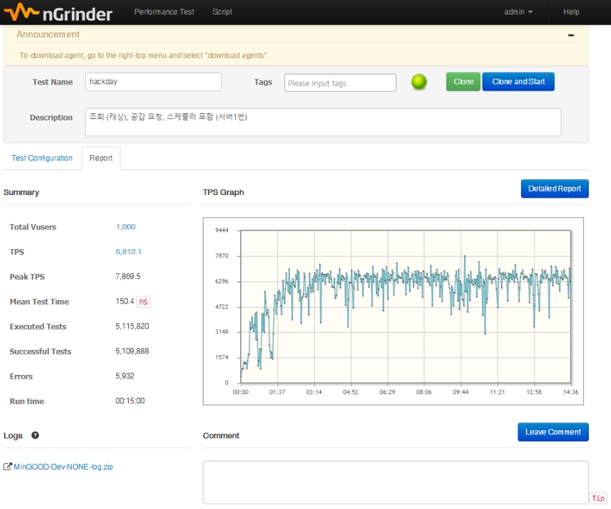

# 인기 댓글 찾기 (2018.05.17 ~ 2018.05.18)
수 많은 사람들이 사용하는 공간에서 정말 인기있는 댓글을 찾으려면 무엇을 알아야 할까?<br/>
대용량 트래픽 속에서도 흔들리지 않는 견고함이 필요합니다.

---

## 성능테스트


--- 

## 시작하기
pom.xml
```
<dependencies>
    <!-- spring boot web -->
    <dependency>
        <groupId>org.springframework.boot</groupId>
        <artifactId>spring-boot-starter-web</artifactId>
        <exclusions>
            <exclusion>
                <groupId>com.fasterxml.jackson.core</groupId>
                <artifactId>jackson-databind</artifactId>
            </exclusion>
        </exclusions>
    </dependency>

    <!-- jackson for json data binding-->
    <dependency>
        <groupId>com.fasterxml.jackson.core</groupId>
        <artifactId>jackson-core</artifactId>
        <version>${jackson.version}</version>
    </dependency>
    <dependency>
        <groupId>com.fasterxml.jackson.core</groupId>
        <artifactId>jackson-databind</artifactId>
        <version>${jackson.version}</version>
    </dependency>
    <dependency>
        <groupId>org.codehaus.jackson</groupId>
        <artifactId>jackson-core-asl</artifactId>
        <version>${jackson.codehaus.version}</version>
    </dependency>
    <dependency>
        <groupId>org.codehaus.jackson</groupId>
        <artifactId>jackson-mapper-asl</artifactId>
        <version>${jackson.codehaus.version}</version>
    </dependency>

    <!-- redis & jedis-->
    <dependency>
        <groupId>org.springframework.boot</groupId>
        <artifactId>spring-boot-starter-data-redis</artifactId>
        <exclusions>
            <exclusion>
                <groupId>redis.clients</groupId>
                <artifactId>jedis</artifactId>
            </exclusion>
        </exclusions>
    </dependency>
    <dependency>
        <groupId>redis.clients</groupId>
        <artifactId>jedis</artifactId>
        <version>2.9.0</version>
        <scope>compile</scope>
        <exclusions>
            <exclusion>
                <groupId>org.apache.commons</groupId>
                <artifactId>commons-pool2</artifactId>
            </exclusion>
        </exclusions>
    </dependency>

    <!-- pool -->
    <dependency>
        <groupId>org.apache.commons</groupId>
        <artifactId>commons-pool2</artifactId>
        <version>2.4.2</version>
    </dependency>

    <!-- lombok -->
    <dependency>
        <groupId>org.projectlombok</groupId>
        <artifactId>lombok</artifactId>
        <version>1.16.18</version>
        <optional>true</optional>
    </dependency>

    <!-- mybatis & mysql -->
    <dependency>
        <groupId>org.mybatis.spring.boot</groupId>
        <artifactId>mybatis-spring-boot-starter</artifactId>
        <version>1.3.2</version>
    </dependency>
    <dependency>
        <groupId>mysql</groupId>
        <artifactId>mysql-connector-java</artifactId>
        <version>5.1.40</version>
    </dependency>

    <!-- dbcp -->
    <dependency>
        <groupId>org.apache.commons</groupId>
        <artifactId>commons-dbcp2</artifactId>
        <version>2.1.1</version>
    </dependency>

    <!-- log back -->
    <dependency>
        <groupId>org.slf4j</groupId>
        <artifactId>slf4j-api</artifactId>
        <version>1.7.25</version>
        <scope>compile</scope>
    </dependency>
    <dependency>
        <groupId>ch.qos.logback</groupId>
        <artifactId>logback-classic</artifactId>
        <version>1.2.3</version>
        <exclusions>
            <exclusion>
                <groupId>org.slf4j</groupId>
                <artifactId>slf4j-api</artifactId>
            </exclusion>
        </exclusions>
        <scope>testCompile</scope>
    </dependency>
    <dependency>
        <groupId>org.slf4j</groupId>
        <artifactId>jcl-over-slf4j</artifactId>
        <scope>1.7.25</scope>
    </dependency>

    <!-- spring test-->
    <dependency>
        <groupId>org.springframework.boot</groupId>
        <artifactId>spring-boot-starter-test</artifactId>
        <scope>test</scope>
    </dependency>
</dependencies>
```

## 배포
* Naver Cloud Platform
    * Web Server
    * MySQL Server
    * Redis Server

## 사용 기술
* IntelliJ IDEA - IDE
* Spring Boot - 웹 프레임워크
* Java
* MyBatis
* Maven - 의존성 관리 프로그램
* Tomcat - 웹 애플리케이션 서버
* MySQL - 데이터베이스
* Redis - 사용자 공감 데이터 저장 & Cache
* @Scheduled - 레디스 공감 데이터를 주기적으로 MySQL에 저장
* JUnit - 테스트 코드 작성 (코드 검증)
* MockMVC - 테스트 코드 작성 (코드 검증)
* nGrinder - 성능 측정

---


